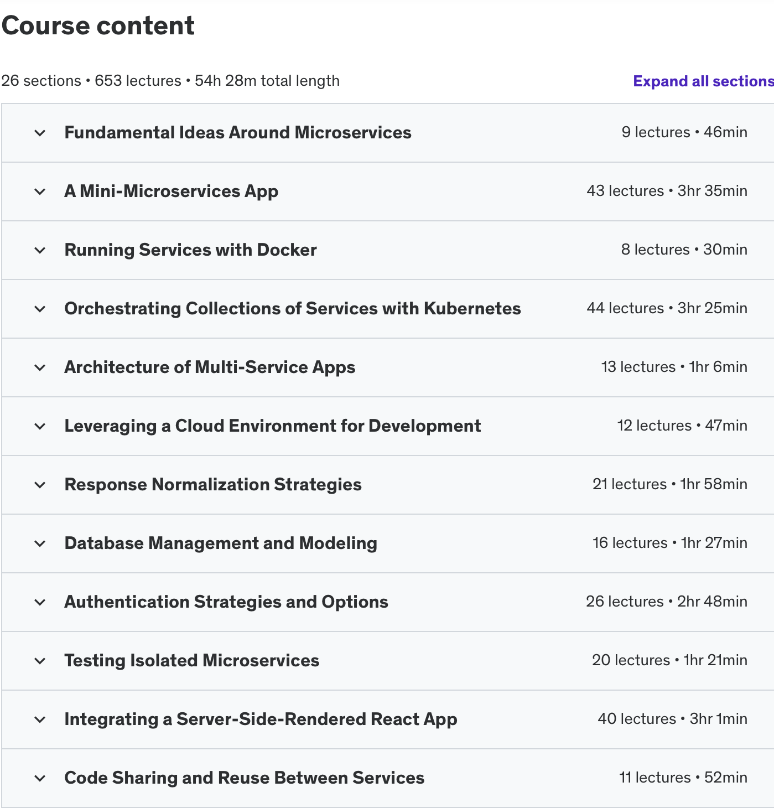

# microservices

https://www.udemy.com/course/microservices-with-node-js-and-react/?couponCode=SEPTSTACK24A

Currently completed "Integrating a Server-Side-Rendered React App" (11/25)

npm module "common" https://www.npmjs.com/package/@yvmicroservices/common?activeTab=code

